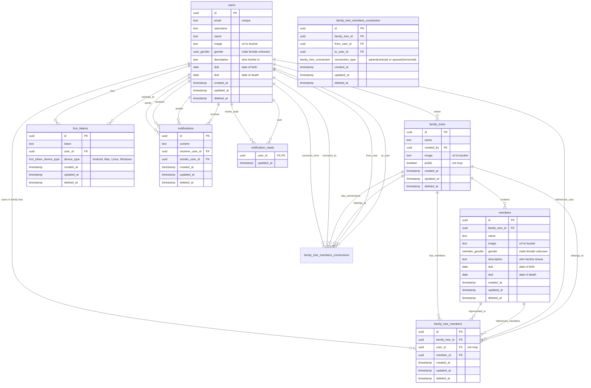

# Family Tree Backend Architecture

## Technologies used

- [NestJS](https://nestjs.com/)
- [Cloudflare R2](https://developers.cloudflare.com/r2/)
- [Zod](https://zod.dev/)
- [Drizzle ORM](https://orm.drizzle.team/)
- [PostgreSQL](https://www.postgresql.org/)
- [Google Auth](https://developers.google.com/identity/protocols/oauth2)
- [JWT](https://jwt.io/)

## Database structure

## APIs

- ### **Auth**

  - **GET** `/auth/google` => Redirect to Google Auth
  - **GET** `/auth/google/callback` => Callback from Google Auth
  - **GET** `/auth/logout` => Logout from current session

- ### **Users**

  - **GET** `/users/me` => Get current user
  - **GET** `/users/{id}` => Get user by id
  - **PUT** `/users` => Update current user
  - **PATCH** `/users/avatar` => Update user avatar to random one

- ### **Family Trees**

  - **GET** `/family-trees` => Get all family trees of current user
  - **GET** `/family-trees/publics/{name}` => Get all public family trees by name (not mvp)
  - **GET** `/family-trees/{id}` => Get members and members connections of family tree
  - **POST** `/family-trees` => Create family tree
  - **PUT** `/family-trees/{id}` => Update family tree by id
  - **DELETE** `/family-trees/{id}` => Delete family tree by id

- ### **Family Tree Members**

  - **GET** `/family-trees/{familyTreeId}/members` => Get members of family tree
  - **GET** `/family-trees/{familyTreeId}/members/{id}` => Get member info by id
  - **POST** `/family-trees/{familyTreeId}/members` => Add member to family tree
  - **PUT** `/family-trees/{familyTreeId}/members/{id}` => Update member by id
  - **DELETE** `/family-trees/{familyTreeId}/members/{id}` => Delete member from family tree

- ### **Family Tree Members Connections**

  - **GET** `/family-trees/{familyTreeId}/members/connections` => Get connections of family tree
  - **GET** `/family-trees/{familyTreeId}/members/{memberUserId}/connections` => Get connections of member
  - **POST** `/family-trees/{familyTreeId}/members/connections` => Add connection to member
  - **PUT** `/family-trees/{familyTreeId}/members/connections/{id}` => Update connection by id
  - **DELETE** `/family-trees/{familyTreeId}/members/connections/{id}` => Delete connection from member

- ### **FCM Tokens**

  - **POST** `/fcm-tokens` => Create fcm token
  - **DELETE** `/fcm-tokens` => Delete fcm token

- ### **Notifications**

  - **GET** `/notifications` => Get notifications of current user
  - **GET** `/notifications/read` => Mark notifications as read

- ### **Files**

  - **POST** `/files/{folder}` => Upload file, either avatar or tree